<p align="center">
  
</p>

<p align="center">
  <strong>The collaborative canvas where teams design, generate, and ship real frontend together.</strong>
</p>

<p align="center">
  Sketch on an infinite canvas, describe a screen in plain language, and an AI agent builds a
  <em>running</em> Next.js app for it — live, in front of your whole team.
</p>

<p align="center">
  <a href="#overview">Overview</a> •
  <a href="#features">Features</a> •
  <a href="#tech-stack">Tech Stack</a> •
  <a href="#architecture">Architecture</a> •
  <a href="#aws-infrastructure">Infrastructure</a> •
  <a href="#getting-started">Getting Started</a> •
  <a href="#api-reference">API</a> •
  <a href="#mcp-server">MCP</a>
</p>

---

## Overview

OpenCraft is a shared workspace for building frontend. You open a project, drop a **screen** onto an
infinite canvas, describe what you want, and an agent builds a working Next.js app for that screen.
Your teammates see the same canvas update live while it happens — not pictures of an app, the actual
app running in a cloud sandbox with hot reload.

It closes the design-to-code handoff: designers, developers, and PMs sit on **one canvas**, sketch an
idea, ask the agent to build it, and watch real screens appear together. It's built for product teams,
startups, and agencies — while still being something a single designer or developer can pick up alone.

OpenCraft runs almost entirely on **AWS**, with the frontend on **Vercel**. Three concerns run in
parallel and are kept deliberately separate so each stays simple:

1. **Real-time collaboration** — a Yjs CRDT synced over AWS AppSync Events.
2. **Durable data** — one Amazon Aurora PostgreSQL database, reached through Drizzle ORM.
3. **Agentic generation** — a stateless Python agent on Amazon Bedrock AgentCore Runtime, powered by
   Anthropic's **Claude** models on Amazon Bedrock.

---

## Features

### 🎨 Infinite Canvas

A custom, Figma-like drawing engine where everything lives together — screens, frames, images, sticky
notes, and freehand drawings on one zoomable surface:

- **Drawing tools**: frames, rectangles, ellipses, lines, arrows, freehand draw, text, sticky notes
- **Pan & zoom**: middle-click / Space+drag to pan, Ctrl/Cmd+wheel to zoom around the cursor
- **Selection**: click, Shift+click multi-select, drag-select box, 8-point resize handles
- **History**: full undo/redo with batched move/resize entries
- **Layers**: sidebar with reordering and visibility
- **Autosave**: debounced persistence to Aurora, with the live canvas state held in a Yjs document

### 👥 Live Multiplayer

Several people can work on one canvas at once:

- **Presence**: see everyone's cursors, selections, and edits instantly
- **CRDT sync**: shapes and screens are a Yjs document fanned out over AWS AppSync Events — edits merge
  cleanly without conflicts
- **Roles**: every project has **viewer / editor / owner** roles; viewers receive updates but can't edit
- **Share links**: owners mint short-lived, role-scoped invite links to bring teammates in

### 🤖 AI UI Coding Agent

You prompt, it builds — a real component tree, not a static mockup:

- **Running apps**: the agent installs packages, writes files, and produces a live Next.js app
- **Iterative**: follow-up prompts edit the same screen; the agent always knows which route it's editing
- **Live narration & reasoning**: the agent's work streams token-by-token, with Claude's extended
  thinking surfaced in a dedicated reasoning panel
- **Self-verifying**: before it can finish, a verification gate runs `tsc --noEmit` so it can't ship a
  broken build
- **Stateless & durable**: the agent owns no state — it reads what the backend sends and reports results
  through a callback, so a generation finishes even if you close the tab
- **Vision**: attach images for the agent to work from

### 👁️ Visual Mode

An agent that checks its own work. When Visual Mode is on, the agent drives a real headless browser
(**AWS AgentCore Browser**) to screenshot its running preview, read the console and network, catch the
Next.js error overlay, and fix layout/runtime issues — the class of problems a type-check can't catch —
before it calls itself done. Off by default, since screenshots cost multimodal tokens.

### 🔀 Flows — Multi-Screen Prototyping

Chain screens to prototype a whole product, not just isolated pages:

- **Create Flow**: from any screen, describe the next page (e.g. "checkout page")
- **Shared sandbox**: flow children reuse the parent screen's sandbox and design system, living at a
  new **route** (e.g. `/checkout`) inside the _same_ running app
- **Visual connectors**: child screens auto-link to their parent with bound elbow arrows
- **Context inheritance**: the agent seeds from the parent's files and adds a route instead of
  overwriting the home page

### 🎭 Design Systems

Theme generated apps and switch between light and dark per screen:

- **17 presets** (Default, Claude, Vercel, Supabase, Cyberpunk, Neo-Brutalism, Catppuccin, T3 Chat, and
  more) backed by tweakcn token sets
- **Bring your own**: import a design system **from any URL** (Firecrawl scrape → Claude extracts a
  shadcn token set), paste raw CSS, or build one manually
- **Per-screen + per-client**: apply a system across screens; agencies can keep a separate look per client
- **Applied in the sandbox**: themes are written into the app (shadcn install or generated `globals.css`),
  never by hand-editing files

### 🌐 Remix from the Web

A companion **Chrome extension** captures any page or component you find while browsing — its HTML,
computed CSS, and metadata — and sends it straight into OpenCraft. The agent rebuilds it as clean code
on your canvas, so anything you like online becomes a starting point you can remix.

You can also ask the agent to **clone / recreate / redesign** a specific URL directly in chat — it
scrapes the live page via Firecrawl and rebuilds it faithfully (real copy, colors, fonts, spacing).

### 🔌 Your Tools, Connected (MCP Client)

Connect **Notion, Linear, and Slack**, and the agent gains those services' own tools for the turn —
using your token — so it can pull real specs, issues, and messages instead of guessing, and act on them
when you ask. Notion and Linear use a standard OAuth 2.1 + Dynamic Client Registration flow; Slack uses a
pasted user token. OpenCraft acts as an **MCP client** to each provider's hosted MCP server.

### 🛰️ Open by API (MCP Server)

OpenCraft is also an **MCP server**. External agents and IDEs can drive a sandbox through scoped API keys
(`oc_…`) — create projects and screens, write files, run commands, apply design systems, place images —
so OpenCraft fits into the workflows you already have.

### ✏️ Visual Edit Mode

Edit generated UI without touching code — click any element in the preview, change colors / spacing /
typography / borders, and changes are mapped to Tailwind classes and written back to the source files.

### 📁 Code Explorer & Export

Browse the complete project tree with Shiki syntax highlighting. When you're ready, **download** the
generated code as an archive — or **copy your design straight to Figma** as editable layers (no plugin
required).

### 💳 Usage & Billing

A per-user generation limit (default **10**) is enforced server-side; one is consumed per successful
build. Subscriptions are served through **Clerk Billing** at `/pricing`.

### 🔐 Authentication

Secure access with **Clerk** — social login, JWT sessions, and per-user records in Aurora.

---

## Tech Stack

### Core Framework

| Technology       | Version | Purpose                                   |
| ---------------- | ------- | ----------------------------------------- |
| **Next.js**      | 16.0.7  | App Router, Server Components, API Routes |
| **React**        | 19.2.0  | UI rendering                              |
| **TypeScript**   | 5.x     | Type-safe development                     |
| **Tailwind CSS** | 4.x     | Utility-first styling (no config file)    |

### Backend & Data (AWS)

| Technology                      | Purpose                                                             |
| ------------------------------- | ------------------------------------------------------------------- |
| **Amazon Aurora PostgreSQL** v2 | Single source of truth — large JSONB blobs **and** relational graph |
| **Drizzle ORM**                 | Type-safe SQL, migrations (`drizzle-kit`)                           |
| **Amazon S3**                   | Image/upload storage, served via presigned URLs                     |
| **AWS AppSync Events**          | Serverless WebSocket pub/sub for real-time collaboration            |
| **AWS Lambda**                  | Token authorizer for AppSync Events channels                        |
| **AWS CDK**                     | Infrastructure-as-code for the collaboration stack                  |

### AI Agent

| Technology                           | Purpose                                                                  |
| ------------------------------------ | ------------------------------------------------------------------------ |
| **Amazon Bedrock AgentCore Runtime** | Hosts the stateless agent; one isolated microVM session / screen         |
| **Strands Agents SDK** (Python)      | Agent loop, tools, streaming                                             |
| **Anthropic Claude on Bedrock**      | The reasoning + code-generation model (`us.anthropic.claude-sonnet-4-6`) |
| **AWS AgentCore Browser**            | Headless browser for Visual Mode self-verification                       |
| **E2B**                              | Per-screen sandbox microVMs running a real Next.js dev server            |
| **Firecrawl**                        | Webpage scraping for cloning + design-system extraction                  |
| **Model Context Protocol**           | Both ways — OpenCraft is an MCP server and an MCP client                 |

### Auth, Billing & Front-of-house

| Technology        | Purpose                         |
| ----------------- | ------------------------------- |
| **Clerk**         | Authentication, user management |
| **Clerk Billing** | Subscriptions (`/pricing`)      |
| **Vercel**        | Next.js hosting                 |

### UI & Realtime libraries

| Library                      | Purpose                              |
| ---------------------------- | ------------------------------------ |
| **Yjs** + **y-protocols**    | CRDT document + awareness (presence) |
| **shadcn/ui** + **Radix UI** | Accessible component primitives      |
| **Framer Motion / motion**   | Animation                            |
| **Shiki**                    | Code syntax highlighting             |
| **Streamdown**               | Streaming markdown rendering         |
| **SWR**                      | Client data fetching/caching         |
| **Lucide React**             | Icons                                |
| **Sonner**                   | Toasts                               |
| **Zod**                      | Schema validation                    |
| **nanoid**                   | Canvas shape IDs                     |

---

## Architecture

### High-Level System Overview

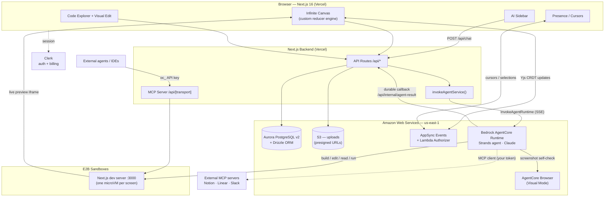

The Next.js backend is the **single front door** to data: only it talks to Aurora and S3. The agent is
stateless — it reads the screen + history the backend sends, works inside an E2B sandbox, and writes
results back through a callback.

---

### AI Agent Workflow

A user prompt becomes a running screen. The live SSE stream drives the UI; a **durable callback**
guarantees persistence even if the browser disconnects mid-generation.

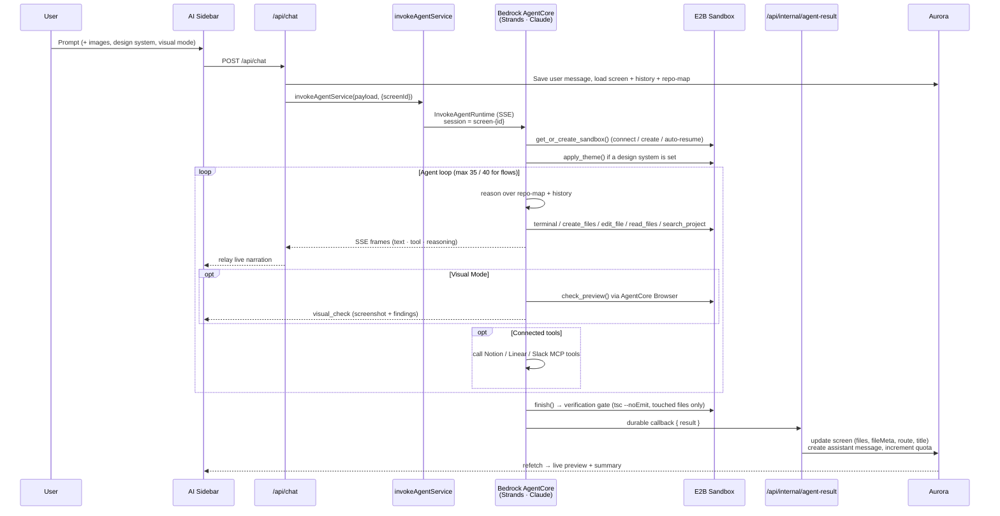

**Transport seam** — `lib/agent-service.ts` exposes one function, `invokeAgentService()`, with two
backends, switched by env:

- **Production**: when `AGENT_RUNTIME_ARN` is set, it calls the SigV4-signed
  `InvokeAgentRuntimeCommand` on Bedrock AgentCore. Each screen maps to a stable `runtimeSessionId`
  (`screen-<uuid>`), so different screens run in **parallel** isolated microVMs.
- **Dev / self-hosted**: otherwise it POSTs to the FastAPI service at `AGENT_SERVICE_URL`
  (default `http://localhost:8080`).

Either way the agent runs its turn in a **decoupled task** and fires the `callback` webhook, so the
result persists independently of the live stream.

**Agent tools:**

| Tool             | Description                                                                                                                       |
| ---------------- | --------------------------------------------------------------------------------------------------------------------------------- |
| `terminal`       | Run shell commands in the sandbox (installs, file ops). Dev/build/start are blocked — the dev server is already running with HMR. |
| `create_files`   | Write complete new files (or full rewrites), batched.                                                                             |
| `edit_file`      | Targeted search-and-replace edits to existing files.                                                                              |
| `read_files`     | Read file contents on demand (paths-only context model).                                                                          |
| `search_project` | grep/regex across the project to locate a symbol/string.                                                                          |
| `scrape_webpage` | Firecrawl a live URL for clone / recreate / redesign requests.                                                                    |
| `check_preview`  | **(Visual Mode)** Screenshot the live preview via AgentCore Browser + report console/network/overlay errors.                      |
| `finish`         | The only way to end a turn — runs the verification gate, returns the delta.                                                       |
| _MCP tools_      | Notion / Linear / Slack tools attached per-turn when those accounts are connected.                                                |

---

### Agent Context Architecture

The agent is fed the **smallest set of high-signal tokens** per turn, with most of the window kept in
the prompt cache. State carries forward through a paths-only **repo-map**, not by dumping the codebase.

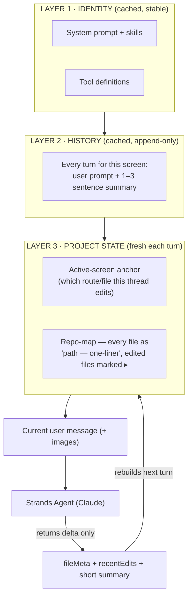

Only Layer 3 + the new message are paid at full price (~2–4k fresh tokens). Cost stays **flat in project
size** — a 100-file app costs about the same as a 10-file one. The agent reads files on demand rather
than having contents pre-injected.

On top of its tools, the agent carries **skills** — packaged expertise such as frontend design judgment,
cloning a page from a URL, and building flows.

---

### Sandbox Lifecycle

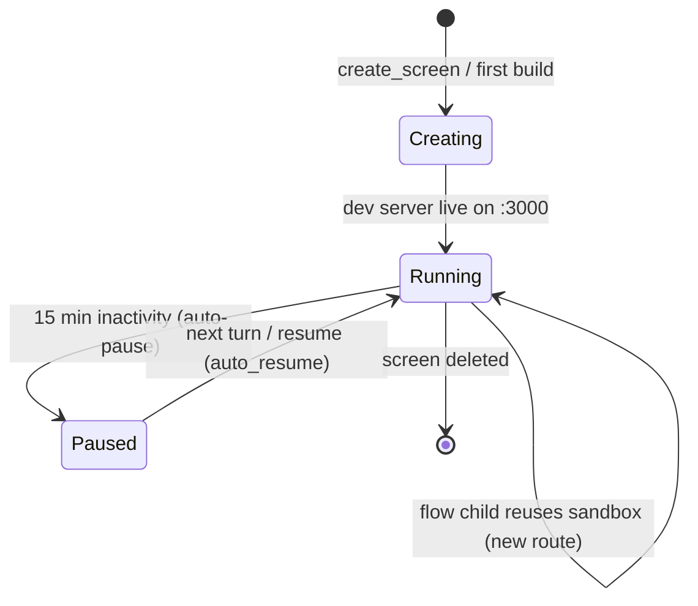

Each screen runs in its own **E2B** microVM from a baked template (`unitset-sandbox-v1`) that already
has Next.js, Tailwind v4, and shadcn/ui. The agent writes files and runs commands inside; the preview is
served back to the canvas iframe. Because each screen is its own session and sandbox, many people can
generate many screens at once without stepping on each other.

---

### Real-Time Collaboration

The shared canvas state — every shape, screen, and who is editing what — is a **Yjs** CRDT document,
synced over **AWS AppSync Events** on a per-project channel (`/canvas/{projectId}`).

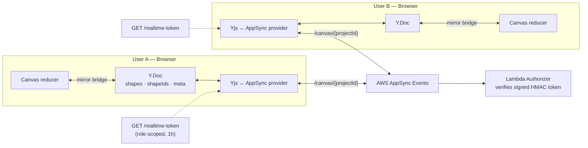

- **Mirror bridge** ([`hooks/use-canvas-doc-sync.ts`](hooks/use-canvas-doc-sync.ts)): reconciles the
  canvas reducer with the Yjs doc — throttled outbound deltas (~40 ms), echo-guarded inbound snapshots,
  and a data-loss guard that rejects an empty remote doc if local has shapes.
- **Presence**: cursors, selections, and "editing" state ride the same channel via Yjs **awareness**,
  deduped per `userId` so a reconnect doesn't leave a ghost cursor.
- **Auth**: the server mints a short-lived HMAC token scoped to `{ userId, projectId, role }`; a Lambda
  authorizer validates it and binds the token to its project's channel. No backend proxies the messages.
- **Sharing**: owners create role-scoped invite links; joining redeems the token and adds a
  `project_members` row (`viewer < editor < owner`).

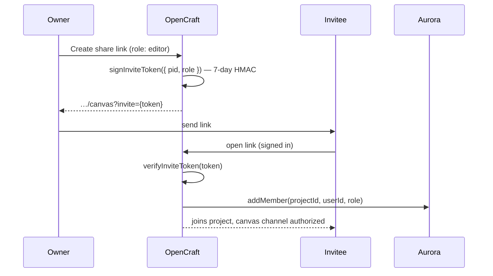

---

### Canvas State Management

The infinite canvas is a custom engine — two independent reducers in React Context, with normalized
entity state for O(1) shape lookups. The shapes reducer is mirrored into the Yjs doc and persisted to
Aurora.

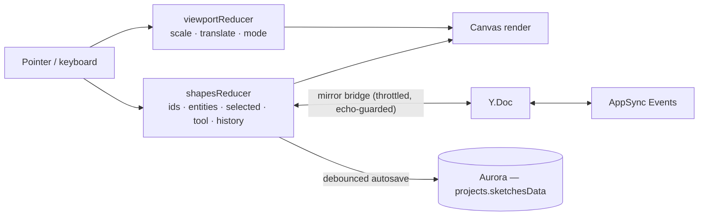

**Shape types:**

```typescript
type Shape =
  | FrameShape // rectangular frames with auto-numbering
  | RectShape // rectangles
  | EllipseShape // ellipses / circles
  | FreeDrawShape // freehand paths
  | ArrowShape // arrows with bindable endpoints
  | LineShape // straight lines
  | TextShape // text with typography controls
  | StickyShape // sticky notes
  | ImageShape // images (pasted, dropped, or MCP-placed)
  | ScreenShape; // AI-generated UI previews (live sandbox iframe)
```

---

### Model Context Protocol — Both Directions

OpenCraft is open at both ends of MCP.

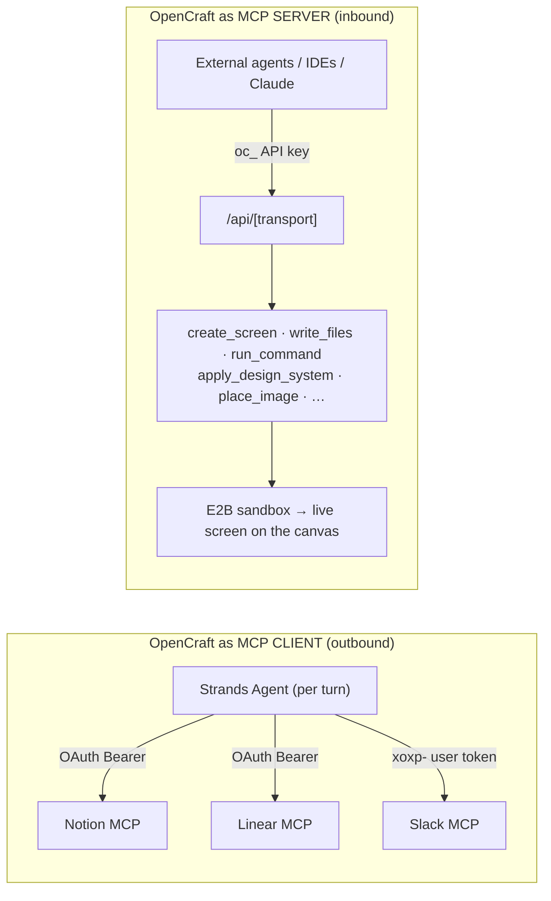

**Outbound (client):** connecting Notion / Linear runs a standard OAuth 2.1 + Dynamic Client
Registration flow; Slack accepts a pasted `xoxp-` user token. Tokens are stored **AES-GCM encrypted**
and never sent to the browser. On each turn, valid connections are decrypted (auto-refreshed if near
expiry) and attached as MCP tool sets for that turn only.

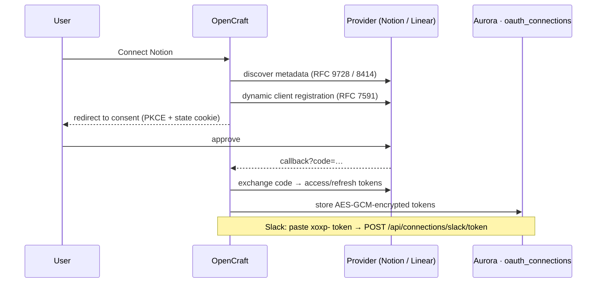

**Inbound (server):** the MCP server ([`app/api/[transport]/route.ts`](app/api/[transport]/route.ts))
exposes sandbox + canvas tools to outside agents, authenticated by `oc_…` API keys (stored only as a
sha256 hash). Guardrails are enforced server-side — it rejects `dev/build/start`, protects port 3000,
and refuses to overwrite `globals.css` / `package.json` / lockfiles. See [MCP Server](#mcp-server).

---

### Design Systems

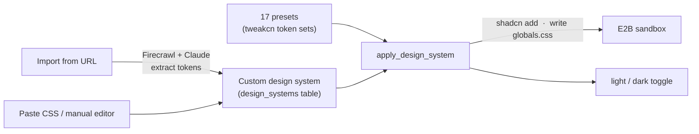

A screen references a system by storing its id in `screens.theme` (`"<id>"` or `"<id>:dark"`). Presets
live in code; custom systems live per-user in the `design_systems` table.

---

### Data Model

All durable state lives in one Aurora PostgreSQL database (Drizzle schema:
[`lib/db/schema.ts`](lib/db/schema.ts)). Large documents (a whole generated app, a whole canvas) are
stored as `jsonb`; foreign keys with cascade deletes clean up the graph automatically.

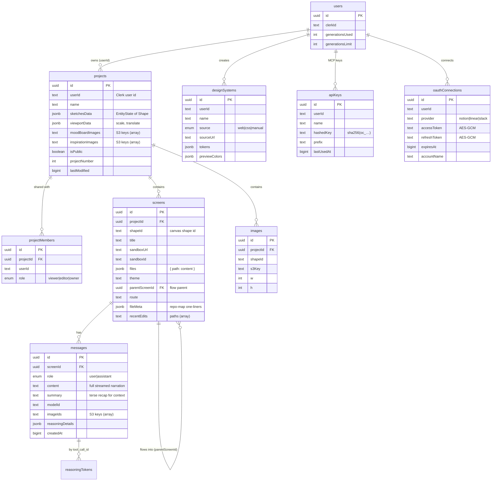

> **Why Aurora PostgreSQL?** A single row can be large — one screen stores a whole generated app as
> JSON, one project stores the whole canvas — well past DynamoDB's 400 KB item limit. But size isn't the
> whole story: the data is also a **graph** (project → screens → messages; projects ↔ members with
> roles; screens self-reference for flows). Aurora PostgreSQL Serverless v2 gives us both big documents
> and real relational integrity (FKs, cascade deletes, plain SQL) in one transactional store that scales
> toward zero when idle.

---

### Provider Hierarchy

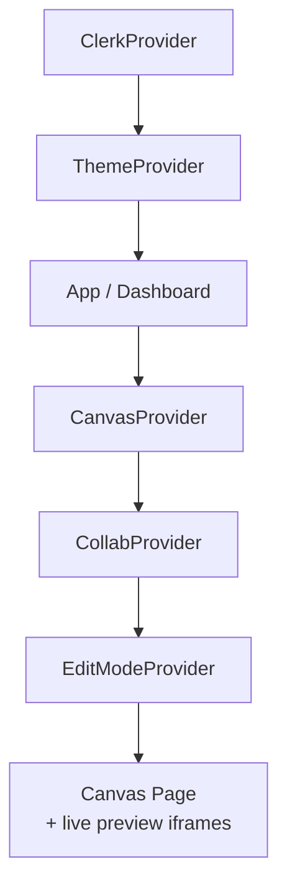

`ClerkProvider` and `ThemeProvider` wrap the app in [`app/layout.tsx`](app/layout.tsx); the canvas page
adds `CanvasProvider` (reducers), `CollabProvider` (Yjs + presence), and `EditModeProvider` (visual edit).

---

## AWS Infrastructure

Everything runs in **`us-east-1`** (chosen for Bedrock availability + Vercel `iad1` co-location).

| Service                             | Resource                                              | Purpose                                                   |
| ----------------------------------- | ----------------------------------------------------- | --------------------------------------------------------- |
| **Aurora PostgreSQL** Serverless v2 | cluster `database-opencraft` (PG 17.7, 0.5–8 ACU)     | All durable state (projects, screens, messages, members…) |
| **S3**                              | `opencraft-uploads-339712700064` (private, presigned) | Image + asset uploads                                     |
| **AppSync Events**                  | `opencraft-collab` API, namespace `canvas`            | Real-time collaboration transport                         |
| **Lambda**                          | `RealtimeAuthorizer` (Node 20)                        | Validates AppSync Events tokens, binds them to a project  |
| **Bedrock AgentCore Runtime**       | `opencraft_agent`                                     | Hosts the stateless Strands agent (Claude)                |
| **AgentCore Browser**               | `aws.browser.v1`                                      | Headless browser for Visual Mode                          |
| **IAM**                             | user `opencraft-s3` (+ `InvokeAgentRuntime` action)   | Scoped programmatic access                                |

The collaboration stack is defined with **AWS CDK** in [`infra/`](infra/) (stack `OpencraftCollab`) and
deploys the AppSync Events API + Lambda authorizer. See [`infra/README.md`](infra/README.md) and the
project's `AWS_INFRA.md` journal for the full footprint and deploy steps.

---

## Getting Started

### Prerequisites

- **Node.js 20+** and **pnpm**
- **Python 3.12+** and **[uv](https://docs.astral.sh/uv/)** (for the agent service)
- Accounts/keys: **AWS** (Aurora, S3, Bedrock, AppSync), **Clerk**, **E2B**, **Firecrawl**
- Optional: **Pexels** (stock images), **Notion / Linear / Slack** (agent integrations)

### Environment Variables — Next.js app (`.env`)

```env
# App
NEXT_PUBLIC_APP_URL=

# Database (Aurora PostgreSQL, SSL required)
DATABASE_URL=postgresql://postgres:<password>@<cluster-endpoint>:5432/postgres?sslmode=require

# AWS — S3 uploads + (prod) Bedrock AgentCore invoke
AWS_REGION=us-east-1
AWS_ACCESS_KEY_ID=
AWS_SECRET_ACCESS_KEY=
S3_BUCKET_NAME=opencraft-uploads-<account-id>

# Auth (Clerk)
NEXT_PUBLIC_CLERK_PUBLISHABLE_KEY=
CLERK_SECRET_KEY=
CLERK_JWT_ISSUER_DOMAIN=
NEXT_PUBLIC_CLERK_SIGN_IN_URL=/sign-in
NEXT_PUBLIC_CLERK_SIGN_UP_URL=/sign-up
CLERK_SIGN_IN_FALLBACK_REDIRECT_URL=/dashboard
CLERK_SIGN_UP_FALLBACK_REDIRECT_URL=/dashboard

# Agent service — dev (FastAPI) OR prod (Bedrock AgentCore)
AGENT_SERVICE_URL=http://localhost:8080      # dev
# AGENT_RUNTIME_ARN=                          # prod: enables the Bedrock AgentCore path
# AGENT_RUNTIME_QUALIFIER=DEFAULT
AGENT_SHARED_SECRET=                          # guards /chat + signs the result callback (must match the service)

# Sandboxes (E2B)
E2B_API_KEY=
E2B_TEMPLATE=unitset-sandbox-v1

# Real-time collaboration (AppSync Events) — outputs from the CDK stack
APPSYNC_EVENTS_REALTIME_URL=
APPSYNC_EVENTS_HTTP_DNS=
APPSYNC_REALTIME_SHARED_SECRET=
NEXT_PUBLIC_APPSYNC_EVENTS_REALTIME_URL=
NEXT_PUBLIC_APPSYNC_EVENTS_HTTP_DNS=

# Integrations (MCP client) — 32-byte base64 key for token encryption
OAUTH_ENC_KEY=
# Optional static creds (else Dynamic Client Registration is used):
# NOTION_CLIENT_ID=  NOTION_CLIENT_SECRET=
# LINEAR_CLIENT_ID=  LINEAR_CLIENT_SECRET=
```

### Environment Variables — Agent service (`agent-service/.env`)

```env
# Sandboxes
E2B_API_KEY=
SANDBOX_TEMPLATE=unitset-sandbox-v1

# Model — Anthropic Claude on Amazon Bedrock
AWS_REGION=us-east-1
AWS_ACCESS_KEY_ID=
AWS_SECRET_ACCESS_KEY=
BEDROCK_MODEL_ID=us.anthropic.claude-sonnet-4-6

# Tool APIs
FIRECRAWL_API_KEY=
PEXELS_API_KEY=

# Server
AGENT_SERVICE_PORT=8080
AGENT_SHARED_SECRET=        # must match the Next.js app
```

### Run it (local dev)

```bash
# 1) Install + migrate the database
pnpm install
pnpm db:push                 # or: pnpm db:migrate

# 2) Start the agent service (terminal 1)
cd agent-service
uv sync
uv run uvicorn agent_service.app:app --port 8080 --reload

# 3) Start the Next.js app (terminal 2)
pnpm dev
```

Open <http://localhost:3000>. For real-time collaboration, deploy the CDK stack in `infra/` and fill in
the `APPSYNC_*` vars (the app degrades gracefully to single-player without them).

### Deploy

- **Frontend** → Vercel (`pnpm build`).
- **Agent service** → Amazon Bedrock AgentCore Runtime — see
  [`agent-service/DEPLOY.md`](agent-service/DEPLOY.md). Set `AGENT_RUNTIME_ARN` in the Next.js env to
  switch `/api/chat` onto the AgentCore path; unset it to instantly fall back to FastAPI.
- **Collaboration infra** → `cd infra && npm run deploy`.

---

## API Reference

All browser routes authenticate with Clerk; project routes enforce `viewer < editor < owner` via
`requireProjectAccess()`.

### Chat & Agent

| Method | Path                         | Description                                                            |
| ------ | ---------------------------- | ---------------------------------------------------------------------- |
| POST   | `/api/chat`                  | Send a message; relays the agent's SSE stream to the browser           |
| POST   | `/api/internal/agent-result` | Durable callback from the agent service (persists the terminal result) |

```typescript
// POST /api/chat — request
{
  screenId: string,
  message: string,
  modelId?: string,
  thinking?: boolean,
  visualMode?: boolean,
  imageUrls?: string[],
  imageIds?: string[],
  designSystem?: string
}
// → streams SSE frames: sandbox · text · tool · tool_detail · reasoning · visual_check · result · error
```

> Generation-limit enforcement and quota increment happen inside the turn (the agent gates on quota; the
> callback increments on success), not as an HTTP error on `/api/chat`.

### Projects, Canvas & Collaboration

| Method          | Path                                       | Description                                  |
| --------------- | ------------------------------------------ | -------------------------------------------- |
| GET / POST      | `/api/projects`                            | List / create projects                       |
| DELETE          | `/api/projects/[projectId]`                | Delete a project                             |
| GET / PUT       | `/api/projects/[projectId]/canvas`         | Load / save canvas state                     |
| GET             | `/api/projects/[projectId]/realtime-token` | Mint an AppSync Events auth token            |
| GET/POST/DELETE | `/api/projects/[projectId]/members`        | List / invite / remove members (owner-gated) |
| POST            | `/api/projects/[projectId]/join`           | Redeem an invite token                       |

### Screens, Messages & Images

| Method       | Path                            | Description                             |
| ------------ | ------------------------------- | --------------------------------------- |
| GET / POST   | `/api/screens`                  | Query (by shapeId / projectId) / create |
| PATCH/DELETE | `/api/screens/[screenId]`       | Update metadata / delete                |
| GET          | `/api/screens/[screenId]/files` | Fetch a screen's heavy `files` blob     |
| POST         | `/api/screens/flow`             | Create a flow child screen              |
| GET / POST   | `/api/messages`                 | Fetch / create messages for a screen    |
| GET / DELETE | `/api/images`                   | List / delete canvas images             |

### Connections (MCP client)

| Method | Path                                   | Description                             |
| ------ | -------------------------------------- | --------------------------------------- |
| GET    | `/api/connections`                     | Connection status for all providers     |
| GET    | `/api/connections/[provider]/start`    | Begin OAuth (discovery, DCR, PKCE)      |
| GET    | `/api/connections/[provider]/callback` | OAuth callback → store encrypted tokens |
| POST   | `/api/connections/[provider]/token`    | Store a pasted token (Slack)            |
| DELETE | `/api/connections/[provider]`          | Disconnect a provider                   |

### MCP server keys, Design systems, Uploads, Users

| Method          | Path                                         | Description                                       |
| --------------- | -------------------------------------------- | ------------------------------------------------- |
| GET/POST/DELETE | `/api/mcp-keys`                              | List / create / revoke `oc_…` MCP API keys        |
| GET/POST        | `/api/design-systems`                        | List presets + custom / create custom             |
| PATCH/DELETE    | `/api/design-systems/[id]`                   | Update / delete a custom design system            |
| POST            | `/api/design-systems/import-web`             | Extract a design system from a URL (SSE progress) |
| POST            | `/api/uploads`                               | Mint a presigned S3 PUT URL                       |
| POST            | `/api/uploads/urls`                          | Resolve S3 keys → presigned GET URLs              |
| POST            | `/api/uploads/delete`                        | Delete owned S3 objects                           |
| POST / GET      | `/api/users/ensure` · `/metadata` · `/stats` | Ensure a user record / fetch metadata / quota     |

### Sandbox

| Method | Path                                         | Description                              |
| ------ | -------------------------------------------- | ---------------------------------------- |
| POST   | `/api/sandbox/resume`                        | Resume a paused sandbox → preview URL    |
| POST   | `/api/sandbox/theme`                         | Apply a design system to the sandbox     |
| GET    | `/api/sandbox/download`                      | Archive the project → presigned download |
| GET    | `/api/sandbox/files` · `/files/content`      | List dir / read file                     |
| POST   | `/api/sandbox/files/write`                   | Write a file (hot-reload)                |
| POST   | `/api/sandbox/edit-mode/enable` · `/disable` | Toggle the visual-edit overlay           |

---

## MCP Server

External agents and IDEs drive a sandbox through the OpenCraft MCP server at `/api/[transport]`,
authenticated with an `oc_…` API key (mint one at `/api/mcp-keys`).

| Tool                  | Description                                     |
| --------------------- | ----------------------------------------------- |
| `list_projects`       | List the user's projects                        |
| `create_project`      | Create a new project (canvas)                   |
| `list_screens`        | List screens on a project                       |
| `get_screen`          | Screen details + file paths                     |
| `create_screen`       | Spin up a sandbox + add a screen to the canvas  |
| `write_files`         | Create/overwrite files (hot-reloads)            |
| `read_files`          | Read files from the sandbox                     |
| `edit_file`           | Search-and-replace in a file                    |
| `run_command`         | Run a shell command (dev/build/start blocked)   |
| `get_preview_url`     | Resume the sandbox + return the live URL        |
| `apply_design_system` | Theme the sandbox (preset or custom)            |
| `list_design_systems` | List presets + the user's custom systems        |
| `place_image`         | Place an image on the canvas (by URL or S3 key) |
| `list_images`         | List images on a project's canvas               |

The dev server is already running on port 3000 with hot reload — the server enforces this (rejects
`dev/build/start`, protects port 3000, and refuses to overwrite `globals.css` / `package.json` /
lockfiles).

---

## Project Structure

```
opencraft/
├── app/                          # Next.js App Router
│   ├── (auth)/                   # Clerk sign-in / sign-up
│   ├── api/                      # API routes (see API Reference)
│   │   ├── chat/                 #   agent chat (SSE relay)
│   │   ├── internal/agent-result #   durable callback from the agent
│   │   ├── [transport]/          #   MCP server (mcp-handler)
│   │   ├── projects/ screens/ messages/ images/
│   │   ├── connections/          #   OAuth (Notion/Linear) + token (Slack)
│   │   ├── design-systems/ mcp-keys/ uploads/ users/
│   │   └── sandbox/              #   resume, theme, files, edit-mode, download
│   ├── dashboard/[projectId]/canvas/   # the canvas page
│   └── pricing/                  # Clerk Billing pricing table
│
├── agent-service/                # Python Strands agent (Bedrock AgentCore)
│   └── src/agent_service/
│       ├── app.py                #   FastAPI (dev) entrypoint
│       ├── agentcore_entrypoint.py   # Bedrock AgentCore entrypoint
│       ├── runner/               #   harness, durable callback, stream, gate, finish
│       ├── context/              #   repo-map, history, file-meta, assembler
│       ├── prompt/               #   system prompt + skill blocks
│       ├── tools/                #   files, terminal, sandbox, search, scrape, visual, mcp
│       ├── models.py config.py   #   model + settings
│       └── extract_design.py     #   web → design-system extraction
│
├── components/
│   ├── canvas/                   # canvas, AI sidebar, presence, toolbars, modals
│   │   ├── shapes/ property-controls/ code-explorer/ edit-mode/
│   │   ├── connections/ design-systems/
│   ├── ai-elements/ dashboard/ landing/ ui/
│
├── contexts/                     # CanvasContext, CollabContext, EditModeContext
├── hooks/                        # use-infinite-canvas, use-canvas-doc-sync, use-chat-streaming,
│                                 #   use-edit-mode, use-figma-export, use-autosave, …
├── lib/
│   ├── db/                       # Drizzle schema, queries, serialize
│   ├── realtime/                 # AppSync Events client, Yjs ↔ AppSync provider, canvas-doc
│   ├── connections/              # OAuth registry, flow, token crypto
│   ├── mcp/                      # MCP server auth, sandbox, canvas mutations
│   ├── canvas/                   # reducers, hit-testing, themes, design-system parsing
│   ├── edit-mode/                # CSS→Tailwind mapper, overlay script
│   ├── server/                   # Clerk helpers, realtime-token, crypto, errors
│   └── agent-service.ts s3.ts    # agent transport seam + S3
│
├── drizzle/                      # SQL migrations
├── infra/                        # AWS CDK — AppSync Events + Lambda authorizer
├── sandbox-templates/nextjs/     # E2B template (baked Next.js + Tailwind + shadcn + Figma bridge)
└── types/                        # canvas + project types
```

---

## Keyboard Shortcuts

### Canvas

| Shortcut                                | Action          |
| --------------------------------------- | --------------- |
| `S`                                     | Select tool     |
| `H` / `Space`                           | Hand (pan) tool |
| `F`                                     | Frame tool      |
| `R`                                     | Rectangle tool  |
| `C`                                     | Ellipse tool    |
| `L`                                     | Line tool       |
| `A`                                     | Arrow tool      |
| `D`                                     | Freedraw tool   |
| `T`                                     | Text tool       |
| `E`                                     | Eraser tool     |
| `Delete` / `Backspace`                  | Delete selected |
| `Ctrl/Cmd + Z`                          | Undo            |
| `Ctrl/Cmd + Shift + Z` / `Ctrl/Cmd + Y` | Redo            |
| `Ctrl/Cmd + C` / `V`                    | Copy / Paste    |

### Zoom & Pan

| Shortcut           | Action             |
| ------------------ | ------------------ |
| `Ctrl/Cmd + Wheel` | Zoom around cursor |
| `Wheel`            | Pan vertically     |
| `Shift + Wheel`    | Pan horizontally   |

---

## AI Models

The agent runs on **Anthropic's Claude models via Amazon Bedrock**, hosted on **Bedrock AgentCore
Runtime** with the **Strands Agents SDK**. Each successful build consumes one generation.

| Model             | Provider               | Model ID                         | Vision |
| ----------------- | ---------------------- | -------------------------------- | ------ |
| **Claude Sonnet** | Anthropic (on Bedrock) | `us.anthropic.claude-sonnet-4-6` | ✅     |

Extended thinking can be toggled per turn — Claude's reasoning streams into a dedicated panel and is
persisted with the message.

---

## Generation Limits

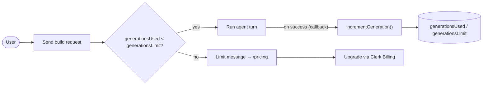

Each user starts with a default of **10 generations**. The agent gates on remaining quota before a run,
and the durable callback increments `generationsUsed` only when a build completes successfully.
Subscriptions are handled through Clerk Billing at `/pricing`.

---

## Contributing

1. Fork the repository
2. Create a feature branch: `git checkout -b feature/amazing-feature`
3. Commit changes: `git commit -m 'feature: amazing feature'`
4. Push to the branch and open a Pull Request

---

## License

Licensed under the Apache License 2.0 — see [LICENSE](LICENSE).

---

<p align="center">
  Built with ❤️ by Adithya Vardhan
</p>
